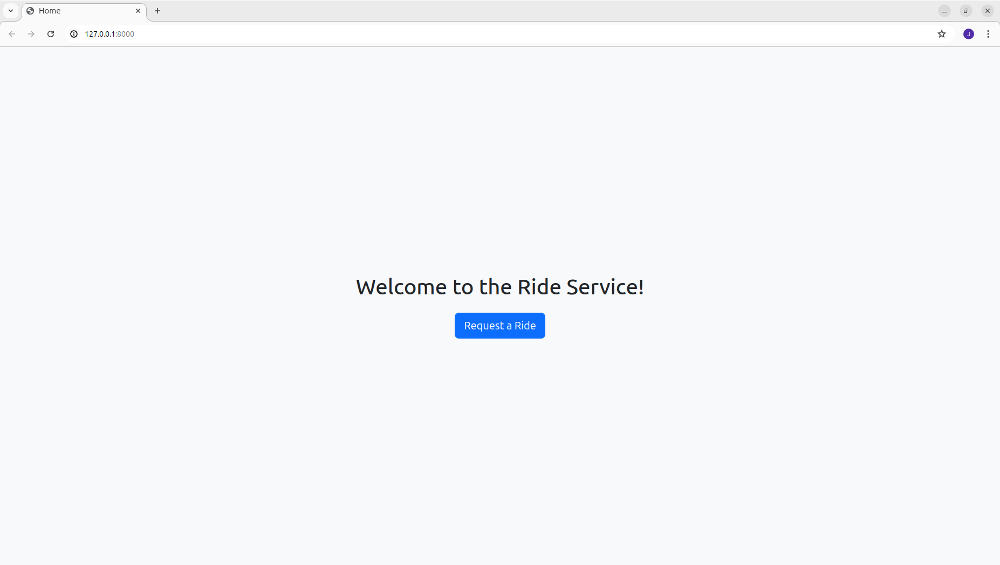
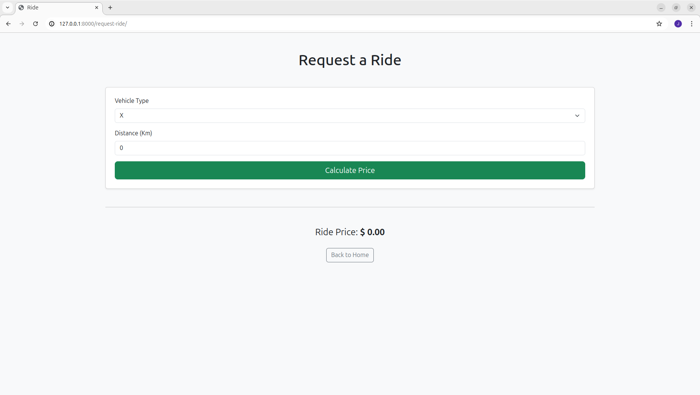

# Django Request Ride

This is a simple Django project for requesting rides. It allows users to select the type of vehicle and specify the distance to calculate the price of the ride.

## Screenshots

### Home


### Request a Ride



### Installation

1. **Clone the Repository**
   ```bash
   git clone https://github.com/JoaoRobert0/django-request-ride.git
   ```
2. **Navigate to the Project Directory**
    ```bash
   cd django-request-ride
   ```
3. **Create and Activate a Virtual Enviroment**
    ```bash
    python3 -m venv venv
    source venv/bin/activate
    ```
4. **Install the requirements file**
    ```bash
    pip install -r requirements.txt
    ```
5. **Apply Migrations**
    ```bash
    python manage.py migrate
    ```
6. **Run the Development Server**
    ```bash
    python manage.py runserver
    ```
7. **Open a Web Browser and Go To**
    ```bash
    http://127.0.0.1:8000/
    ```